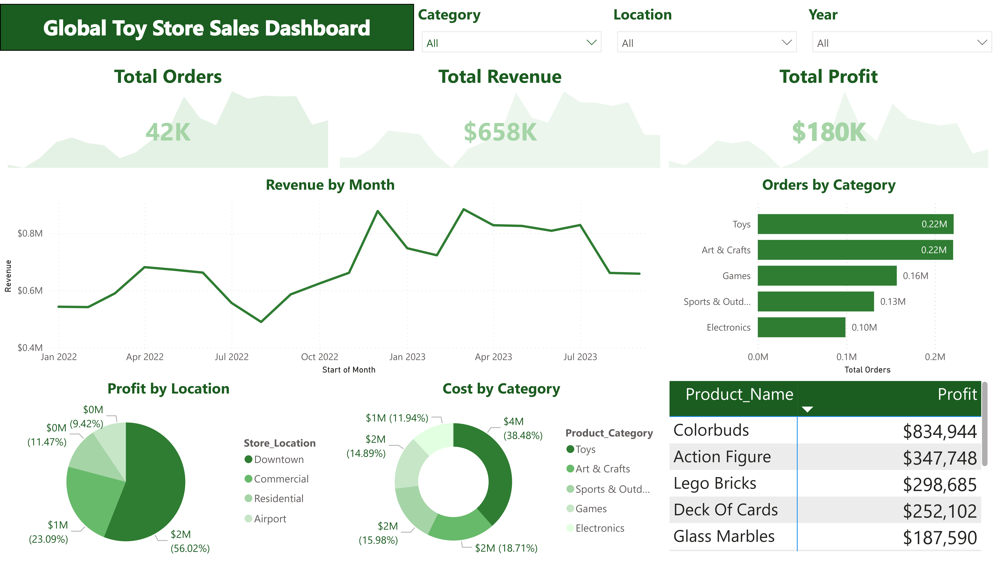

# Global Toy Store Sales Dashboard 📊

## 📌 Project Overview
This project presents an interactive **Power BI sales performance dashboard** built for a global toy store.  
The dashboard provides a clear overview of **orders, revenue, profit, category performance, and regional insights**, enabling stakeholders to make data-driven decisions quickly and effectively.

The focus of this project is on:
- Clean KPI design
- Correct time-based trend analysis
- Consistent color theming
- Business-focused insights

---

## 🧩 Dashboard Preview

---

## 🎯 Key Business Questions Answered
- How are **total orders, revenue, and profit** performing over time?
- Which **product categories** generate the most orders?
- Which **store locations** contribute the most profit?
- How does **monthly revenue trend** change year-over-year?
- Which **products** are the most profitable?

---

## 📈 Key KPIs
- **Total Orders:** 42K  
- **Total Revenue:** $658K  
- **Total Profit:** $180K  

Each KPI includes a **monthly trend (sparkline)** for quick performance monitoring.

---

## 📊 Visualizations Included
- KPI Cards with monthly trends  
- Line Chart: Revenue by Month  
- Bar Chart: Orders by Product Category  
- Donut Chart: Profit by Store Location  
- Donut Chart: Cost by Product Category  
- Table: Product-wise Profit Summary  

---

## 🎨 Design & Theme
- **Primary Theme:** Green (business-friendly and clean)
- **Color Strategy:**
  - Green for performance metrics
  - Light green shades for comparisons
  - Neutral grey background for readability
- Minimal clutter with clear visual hierarchy
- Consistent formatting across all visuals

---

## 🧠 Technical Highlights
- Corrected **time-based sorting** using Year–Month logic to ensure accurate trend analysis
- Optimized KPI visuals for clarity and performance
- Clean data model with proper relationships
- User-friendly slicers for:
  - Category
  - Location
  - Year

---

## 🛠 Tools & Technologies
- **Power BI**
- **Power Query**
- **DAX (for measures and KPIs)**
- **Excel / CSV (data source)**

---

---

## 🚀 How to Use
1. Download the `.pbix` file
2. Open it in **Power BI Desktop**
3. Explore insights using slicers and filters
4. Review trends and performance metrics interactively

---

## 📌 Insights & Learnings
- Proper date sorting is critical for accurate trend visuals
- Consistent color themes improve dashboard readability
- KPIs with trends provide faster business context than static numbers
- Clean design matters as much as correct calculations

---

## 📬 Contact
If you’d like to discuss this project or collaborate:

- **LinkedIn:** (Add your LinkedIn profile link)
- **GitHub:** (Your GitHub profile)
- **Portfolio:** (Optional)

---

⭐ *If you found this project helpful, feel free to star the repository!*

